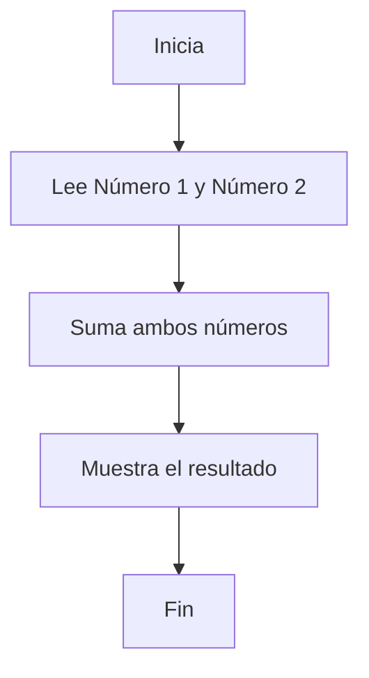
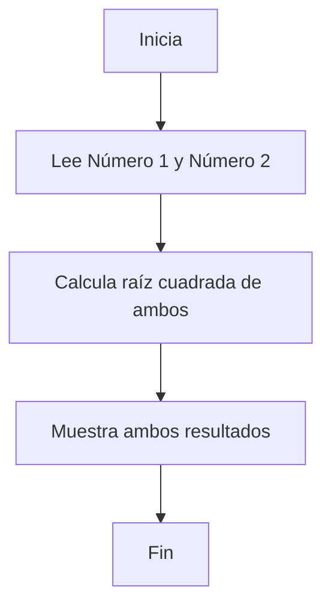

# Calculadora Básica con Flet

Una calculadora simple desarrollada en Python usando el framework Flet para interfaces gráficas modernas.

---

## 📑 Manual Técnico

### Requisitos y dependencias

- **Python 3.8+**
- **Flet** (interfaz de usuario)
- **Math** (módulo estándar de Python)

#### Instalación

1. Clona este repositorio:

   ```bash
   git clone https://github.com/valadezmolinadulcemaria-del/APP03.git
   ```

2. Ingresa al directorio del proyecto:

   ```bash
   cd APP03/calculadora
   ```

3. Instala las dependencias:

   ```bash
   pip install flet
   ```

#### Estructura de Archivos

```
calculadora/
└── src/
    └── main.py    # Código fuente principal de la calculadora
```

#### Ejecución

Desde la carpeta `calculadora/src/`, ejecuta:

```bash
python main.py
```

Esto abrirá la aplicación en tu navegador web por defecto.

---

## 👩‍💻 Manual de Usuario

### Descripción general

La calculadora permite realizar las siguientes operaciones:

- Suma
- Resta
- Multiplicación
- División
- Porcentaje
- Raíz cuadrada

### Uso de la aplicación

1. **Ingresa dos números** en los campos "Número 1" y "Número 2".
2. **Selecciona la operación** que deseas realizar haciendo clic en el botón correspondiente:
   - `+ Sumar`
   - `- Restar`
   - `x Multiplicar`
   - `÷ Dividir`
   - `% Porcentaje` (Calcula el porcentaje del primer número respecto al segundo)
   - `√ Raíz Cuadrada` (Muestra la raíz cuadrada de ambos números)
3. **Visualiza el resultado** en la parte central de la pantalla.
4. Si se comete un error (por ejemplo, texto no numérico), aparecerá el mensaje "Error".

#### Nota sobre Porcentaje

- El campo de arriba es el número base y el de abajo es el porcentaje (%) que quieres calcular.

---

## 🧩 Diagramas de flujo

### Suma



- diagrama de la suma,resta, multiplicación , división tiene el mismos diagrama así q solo puse el la suma para ejemplo 

### Raíz Cuadrada



---

## 📷 Vista previa

.png)


## 💫 Resultado de codigp
![resultado de codigo] (/workspaces/APP03/calculadora/src/assets/2025-09-26.png)

---

## Autor

- valadez molina dulce maria
```
flet build windows -v
```

For more details on building Windows package, refer to the [Windows Packaging Guide](https://flet.dev/docs/publish/windows/).
